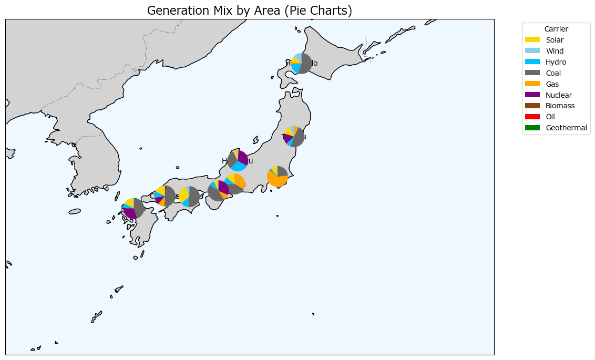
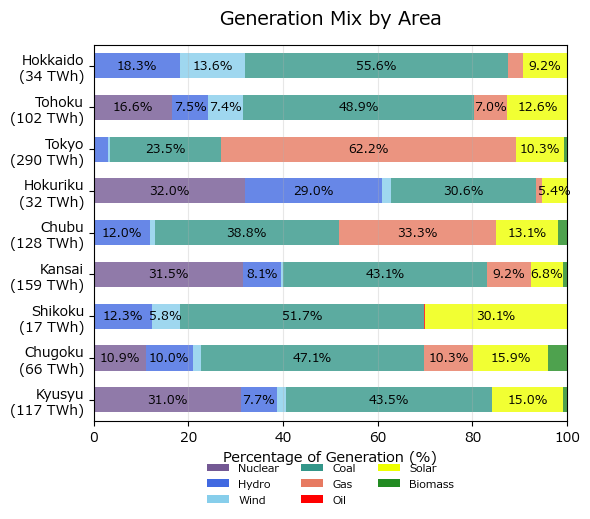

# 日本のPyPSAモデル

本ソフトウェアは柳瀬の東京大学大学院の博士課程の研究の一環として作成されており、MITライセンスで提供される。

## 背景

日本政府は2050年カーボンニュートラルの実現を目標として掲げており、電力部門における脱炭素化が重要な課題となっている。この目標達成のためには、太陽光発電や風力発電といった再生可能エネルギーの大量導入が不可欠である。しかしながら、再生可能エネルギーは気象条件に依存するため出力変動が大きく、電力の需給バランスを維持することが技術的な課題となる。  
従来の電力系統は、火力発電などの調整可能な電源を中心に構成されてきたが、再生可能エネルギーの導入拡大に伴い、電力系統の運用方法を抜本的に見直す必要がある。特に、時々刻々と変化する再生可能エネルギーの出力に対して、どのように需給バランスを調整し、系統の安定性を確保するかが重要な研究課題である。  
このような背景のもと、将来の電力需給バランスを定量的に評価し、再生可能エネルギー大量導入時の系統運用の実現可能性を検証するため、電力系統シミュレーションモデルの構築が求められている。

 

## 目的

本研究では、オープンソースの電力系統最適化ツールであるPyPSA（Python for Power System Analysis）を用いて、日本の電力系統を対象とした需給シミュレーションモデルを構築することを目的とする。具体的には、以下の項目の実現を目指す。

1. **日本の電力系統の再現**: 全国9エリア（北海道、東北、東京、北陸、中部、関西、中国、四国、九州）を対象に、発電設備データ、系統連系線容量、電力需要データを統合したモデルを構築する。

2. **再生可能エネルギーの時系列データの統合**: 太陽光、風力、水力、バイオマスなどの再生可能エネルギーについて、気象データや実績データに基づく時系列出力データをモデルに反映する。

3. **複数年次のシナリオ分析**: 2024年、2030年、2040年、2050年の各年次において、再生可能エネルギーの導入量や電源構成の変化を考慮したシミュレーションを実施し、長期的な電力需給バランスの推移を評価する。

4. **系統運用の最適化検証**: 揚水発電などのエネルギー貯蔵設備を含めた電源の最適運用を算出し、再生可能エネルギー大量導入時における経済性と供給信頼度の両立可能性を検証する。

本モデルを用いることで、日本のカーボンニュートラル実現に向けた電力システムの移行経路の定量的評価が可能となり、政策立案や系統計画における意思決定支援に貢献することが期待される。

# モデルに使用した各種データ

ベースは2024年1月～12月のデータを使用している。  
一部（水力の時系列データ、バイオマス）、2024年のデータが使用できないため、2025年のデータを使用している。

## 需要データ

電力広域的運営推進機関（OCCTO）の公開データは、日本の電力需給の実績をエリア単位で把握するための基礎データである。本モデルでは、各エリアの需要実績時系列を作成するために同データを利用する。

主な活用目的は以下のとおりである。

1. 全国9エリアの需要水準および季節変動の把握  
2. 日別・時間別の負荷パターンの再現  
3. 将来シナリオ比較における基準年（2024年）需要の設定  

本モデルでの利用にあたっては、公開値をそのまま入力するのではなく、欠損や外れ値の確認、時間軸の整合（スナップショットとの一致）などの前処理を行ったうえで、PyPSAの需要データに変換する。

[2024年のデータ（OCCTO公開データ）取得ページ](https://occtonet3.occto.or.jp/public/dfw/RP11/OCCTO/SD/LOGIN_login#)  
取得手順: ダウンロード情報 => CSVダウンロード => 情報ダウンロード  
選択条件の例: エリア・広域ブロック情報 => 需要実績 => 日別 => 期間2024/01/01～2024/12/31 => 全エリアを選択  

## 発電所データ

[JEPX発電情報公開システム](https://hjks.jepx.or.jp/hjks/unit)  
このサイトを使用して、発電機のリストを作成する。日本国内の発電機の情報を確認することができる。  
停止状況・・・・・・・停止しているユニットの一覧が表示される。  
稼働状況・停止状況・・稼働しているユニットの認可出力の合計が表示される。  
ユニット情報・・・・・国内のユニットの一覧表を取得することができる。  

[ユニット別発電実績公開システム](https://hatsuden-kokai.occto.or.jp/hks-web-public/info/home)  
このサイトでバイオマスや水力の発電実績データを確認することができる。  
このデータを使用して、モデルの発電出力の時系列データとする。

### 石炭火力・ガス火力のデータ
石炭火力・ガス火力は発電所の単位でユニット定格出力を合計を発電所の定格出力としている。  

### 太陽光・風力の時系列データ

[Renewable.ninja](https://www.renewables.ninja/)から生成している。  
それぞれのエリアの電力会社の本店の座標の日射量から生成  
エリア内の平準化効果は考慮されていない  

### 一般水力の出力データ

FKlabのデータを使用。（月単位の設備稼働率が設定されているソースは不明）  
全ての一般水力は一つの時系列データに連動して発電している。   
↓
[経済産業省資源エネルギー庁　電力調査統計表　統計・各種データ＞電力関連＞電力調査統計＞統計表一覧(過去データ)](https://www.enecho.meti.go.jp/statistics/electric_power/ep002/results_archive.html#r06)
の2-(1)発電実績を使いデータを作成する。  
北海道電力株式会社、東北電力株式会社、東京電力リニューアブルパワー株式会社、中部電力株式会社、北陸電力株式会社、関西電力株式会社、中国電力株式会社、四国電力株式会社、九州電力株式会社のデータを使用する。  

[詳細](./docs/hydro.md)

### バイオマスの出力データ

日本のバイオマス発電は固定価格買取制度を利用しているため、基本的に出力調整されず、一定の出力で連続運転（ベースロード電源）されることが一般的である。  
そのため発電出力の実績データを入力する。（まだ入力できていない。）  

# 系統データ
系統は各エリアを一つのノードとして本州を北海道、東北、東京、北陸、中部、関西、中国、四国、九州の９つとしている。  

# 進捗状況
## 将来の仕事
- 水力発電の時系列データの整理  
- バイオマス発電の時系列データの整理  
- 風力発電の時系列データがまだ読み込めていない。  
- 投資最適化計算
  - investment_period_weightingsを追加する。  
- バイオマスの反映
- 太陽光、風力のCFデータのAtliteデータへの変更  
- 2024年の実績データとの比較（検証）  

## 完了済み
- 01/15 表示の英語化（現在、進行中、Excelも修正が必要）  
- 11/21 揚水発電所、貯水池の組み込み⇒11/21完了  
- 11/21 太陽光のデータの読み込み方法の修正⇒11/21完了  
- 11/23 一般水力のデータに揚水発電所のデータが入っていたため削除  
- 11/25 原子力発電所の稼働状態を反映  
- 11/25 揚水発電の効率を入力(Excel V5, 効率1⇒0.7）  
- 11/30 揚水発電の効率が正確に反映されていないコードのバグを修正  
- 11/30 一般水力への時系列データの反映（ただし、参考値、公式データは見つかっていない）
- 11/30 風力発電の時系列データの反映（まだ荒いデータ）
- 11/30 需要の各ノードへの割当  

# 参考資料

| サイト・URL |　説明 |
|-----|-----|
| [発電実績データ](https://www.enecho.meti.go.jp/statistics/total_energy001/results.html#headline2) | 発電所の発電実績を確認することができる。 |
| [経済産業省資源エネルギー庁　電力調査統計表　統計・各種データ＞電力関連＞電力調査統計＞統計表一覧](https://www.enecho.meti.go.jp/statistics/electric_power/ep002/results.html) | 過去の発電実績を確認することができる |
|[経済産業省資源エネルギー庁　電力調査統計表　統計・各種データ＞電力関連＞電力調査統計＞統計表一覧(過去データ)](https://www.enecho.meti.go.jp/statistics/electric_power/ep002/results_archive.html#r06)|あああ|
|[各エリアの太陽光風力設備容量2024年](https://www.meti.go.jp/shingikai/enecho/denryoku_gas/saisei_kano/smart_power_grid_wg/pdf/003_01_00.pdf) | 各エリアに導入されているPVおよびWTの設備量が分かる。|

# `DemandSupplySimulation` 環境設定方法

Click to copy each command:

1. **Open Terminal**  
   - Click on `Terminal` -> `New Terminal`

2. **Run Environment Creation Command**
   - Command: `conda env create -f environment.yml`  
     <button onclick="navigator.clipboard.writeText('conda env create -f environment.yml')">Copy Command</button>

3. **Update Existing Environment**  
   - Command: `conda env update -f environment.yml --prune`  
     <button onclick="navigator.clipboard.writeText('conda env update -f environment.yml --prune')">Copy Command</button>

4. **If `conda` is Not Available**  
   - Install conda mini.

### Frequently Used Commands
1. **List Existing Environment**  
   - Command: `conda env list`  
     <button onclick="navigator.clipboard.writeText('conda env list')">Copy Command</button>

