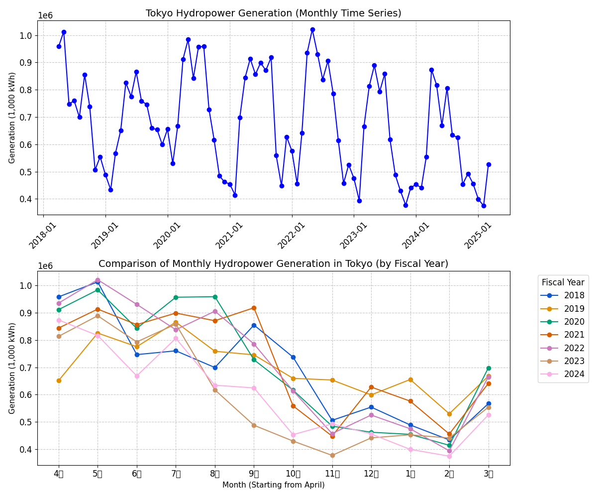

# 水力発電の発電出力データの作成

## 1. 作成の方針

### 1.1 過去の水力発電の発電出力の傾向

図1に、東京電力リニューアブルパワー株式会社の一般水力発電所における各年度の発電実績を示す。本図は以下の2つの視点から発電量の推移を示している。

1. 月別推移（タイムシリーズ）: 2018年4月から2025年3月までの全期間の推移である。
2. 年度別の季節変動比較: 各年度（4月〜翌3月）のデータを重ね合わせ、季節ごとの変動パターンを可視化したものである。

#### 1.1.1 グラフから読み取れる主な特徴

**顕著な季節性:** いずれの年度においても、融雪期にあたる4月から5月にかけて発電量がピークを迎えている。その後、冬の渇水期に向けて徐々に減少する「V字型」の季節変動が明確に確認される。

#### 1.1.2 年度間の差

2021年度（青緑の線）などは全体的に高い水準で推移しているが、直近の2023・2024年度は他年度に比べて春先や秋口の発電量が抑制されている傾向が見受けられる。

## 2. モデルデータ作成方針

需給シミュレーションモデル（PyPSAなど）において、一般水力（流れ込み式）のモデルデータを作成する際の主要な方針を以下に示す。

一般水力は、太陽光や風力と同様に「自然流況」に依存する電源であるが、これらと異なるのは**「季節的な変動（融雪期や渇水期）」と「一定のベースロード性」**を併せ持つ点である。

### 2.1 基本的なモデリング方針

一般水力は、燃料費がゼロで出力調整が困難であるため、シミュレーション上では**「発電コスト最小のベースロード電源」、あるいは「指定された時系列出力を出すGenerator」**として扱う。

- **電源タイプ:** Generator（非調整電源）または Storage Unit（調整能力を考慮する場合）。基本的には、その時の流況に応じた「出力上限」が決まっている Generator としてモデル化する。
- **変数:** 設備容量（kW）に対して、時間別（または月別）の **設備利用率**(**Capacity Factor**)を設定し、出力を決定する。

### 2.2 データ作成の3つのアプローチ

モデルの目的（長期的なエネルギーバランスを評価するか、短期的な需給逼迫を評価するか）によって、以下のいずれかの方針を採用する。

#### 2.2.1 実績統計に基づく「平均的プロファイル」の作成

過去数年間の「電力調査統計」などの実績データから、エリア別の月別発電量を算出する方法である。

- **作成方法:** 本研究で集計した月別発電量を、当該エリアの一般水力設備容量で除し、月別の設備利用率を算出する。
- **メリット:** 実績に基づいているため、マクロなエネルギー収支の整合性が高い。
- **デメリット:** 日々の降雨によるスパイク的な出力変動や、豊水・渇水の年次差が平滑化される。

#### 2.2.2 河川流況（L10供給力）に基づく安全側の作成

電力広域的運営推進機関（OCCTO）の供給計画等で用いられる、**「L10供給力（10年に1回の渇水時でも期待できる出力）」**を用いる方法である。

- **作成方法:** 供給計画の資料から、各エリアの夏季・冬季ピーク時の「水力期待出力」をサンプリングし、それをモデルの出力上限とする。
- **メリット:** 需給逼迫時の安定供給（リザーブ）を評価するシミュレーションに適している。
